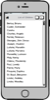
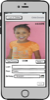
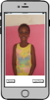
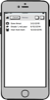
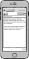

# kidfo - Kid Info
An Iphone application to help track the life events of the children of Source
of Light Center in Port-au-Prince, Haiti.
(_see https://www.facebook.com/centresourcedelumiere/_)

### Information Tracking
This application will track very basic information on each child, initially
including:
- Name
- Birth date
- Multiple photos
- Multiple life event notes

Other information that may be interesting to track in the future would include:
- Parent contact information if applicable and available
- Sibling information if applicable
- Date they arrived at the center
- Date they left the center
These items could be viewed as just additional life events

### Screens

| Mockup | Name | Description |
| --- | --- | --- |
|  | List of Children | Presents a list of children's names sorted alphabetically by last name. Allows for the addition of a new child and the deletion of an existing child. |
|  | Child Detail | Displays the detailed information about the child, including a picture, name, and birthdate. Allows for additional pictures of the child to be captured. |
|  | Capture Picture | Standard picture capturing screen. Allows the capture of a new image of the child. |
|  | Child Notes | Presents a list of life events for this child, including family, educational, and medical events. Allows for the deletion of an event as well as the creation of a new life event note. |
|  | Note Details | Displays the detailed information of a life event for the child including the ability to set the events data and category. |
